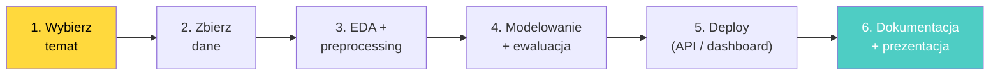

# **Lekcja 42: Przygotowanie projektu dyplomowego**

#lekcja #datascience #projekt #dyplom #portfolio #prezentacja #end-to-end

W tej lekcji przygotujemy Cię do realizacji projektu dyplomowego -- samodzielnego projektu Data Science, który podsumuje wszystko czego się nauczyłeś. Poznasz jak wybrać temat, zaplanować pracę, zorganizować kod i dane, oraz jak przygotować profesjonalną prezentację wyników. Projekt dyplomowy to Twoja wizytówka -- pokaż co potrafisz!

---

## 1. Cel projektu dyplomowego

> [!definition]
> **Projekt dyplomowy** to samodzielny, kompletny projekt Data Science, który demonstruje Twoje umiejętności: od zdefiniowania problemu, przez zbieranie danych, EDA, budowę modelu, aż po wdrożenie i prezentację wyników. To nie jest ćwiczenie -- to PRAWDZIWY projekt, który może trafić do Twojego portfolio.


![[Screenshot 2026-04-24 at 15.52.37.png]]


### Co oceniamy?

| Kryterium | Waga | Opis |
|---|---|---|
| Definicja problemu | 15% | Jasne sformułowanie pytania biznesowego/naukowego |
| Dane i EDA | 15% | Jakość danych, czyszczenie, analiza eksploracyjna |
| Feature engineering | 15% | Kreatywne tworzenie cech, uzasadnienie wyborów |
| Modelowanie | 20% | Porównanie modeli, tuning, walidacja, metryki |
| Wdrożenie | 15% | API, Docker, Cloud (minimum: działający endpoint) |
| Prezentacja | 10% | Czytelność, storytelling, wnioski |
| Green IT | 10% | Świadomość efektywności, optymalizacje |

---

## 2. Wybór tematu

### Przykład 1: Generator pomysłów na projekty

```python
# Pomysły na projekty dyplomowe -- pogrupowane tematycznie
projects = {
    "Klasyfikacja": [
        {
            "tytul": "Predykcja churnu klientów telekomunikacyjnych",
            "dataset": "Telco Customer Churn (Kaggle)",
            "trudnosc": "średnia",
            "umiejetnosci": "EDA, feature engineering, klasy niezbalansowane, SHAP",
            "deploy": "FastAPI endpoint",
        },
        {
            "tytul": "Detekcja spamu w emailach/SMS",
            "dataset": "SMS Spam Collection (UCI)",
            "trudnosc": "średnia",
            "umiejetnosci": "NLP, TF-IDF, BERT fine-tuning, pipeline",
            "deploy": "API z interfejsem webowym",
        },
        {
            "tytul": "Diagnostyka nowotworów z danych medycznych",
            "dataset": "Breast Cancer Wisconsin (sklearn)",
            "trudnosc": "łatwa",
            "umiejetnosci": "Klasyfikacja binarna, metryki medyczne, interpretowalność",
            "deploy": "Streamlit dashboard",
        },
        {
            "tytul": "Rozpoznawanie chorób roślin ze zdjęć",
            "dataset": "PlantVillage (Kaggle)",
            "trudnosc": "trudna",
            "umiejetnosci": "CNN, transfer learning, augmentacja, mobile deploy",
            "deploy": "API + simple frontend",
        },
    ],
    "Regresja": [
        {
            "tytul": "Prognozowanie cen mieszkań",
            "dataset": "California Housing lub Ames Housing",
            "trudnosc": "średnia",
            "umiejetnosci": "Regresja, feature engineering, interpretowalność",
            "deploy": "Kalkulator cen (API)",
        },
        {
            "tytul": "Przewidywanie zużycia energii budynku",
            "dataset": "Energy Efficiency (UCI)",
            "trudnosc": "średnia",
            "umiejetnosci": "Regresja, Green IT, optymalizacja",
            "deploy": "Dashboard z prognozą",
        },
    ],
    "NLP": [
        {
            "tytul": "Analiza sentymentu recenzji produktów",
            "dataset": "Amazon Reviews / IMDB",
            "trudnosc": "średnia",
            "umiejetnosci": "NLP, TF-IDF vs BERT, porównanie metod",
            "deploy": "API do analizy sentymentu",
        },
        {
            "tytul": "Automatyczne streszczanie artykułów",
            "dataset": "CNN/DailyMail (Hugging Face)",
            "trudnosc": "trudna",
            "umiejetnosci": "Seq2Seq, Transformer, ROUGE metryki",
            "deploy": "API do streszczania",
        },
    ],
    "Szeregi czasowe": [
        {
            "tytul": "Prognozowanie sprzedaży detalicznej",
            "dataset": "Store Sales (Kaggle) lub Rossmann",
            "trudnosc": "średnia",
            "umiejetnosci": "Szeregi czasowe, sezonowość, LSTM vs XGBoost",
            "deploy": "Dashboard z prognozą 30 dni",
        },
        {
            "tytul": "Predykcja cen kryptowalut",
            "dataset": "Yahoo Finance / CoinGecko API",
            "trudnosc": "trudna",
            "umiejetnosci": "Szeregi czasowe, cechy techniczne, LSTM",
            "deploy": "Live dashboard",
        },
    ],
    "Computer Vision": [
        {
            "tytul": "Klasyfikacja obrazów medycznych (RTG/CT)",
            "dataset": "ChestX-ray14 lub COVID-19 Radiography",
            "trudnosc": "trudna",
            "umiejetnosci": "CNN, transfer learning, Grad-CAM interpretowalność",
            "deploy": "API + upload obrazu",
        },
        {
            "tytul": "System rozpoznawania znaków drogowych",
            "dataset": "GTSRB (German Traffic Sign)",
            "trudnosc": "średnia",
            "umiejetnosci": "CNN, augmentacja, real-time inference",
            "deploy": "API z kamerą",
        },
    ],
    "Unsupervised + Anomalie": [
        {
            "tytul": "System wykrywania fraudów bankowych",
            "dataset": "Credit Card Fraud (Kaggle)",
            "trudnosc": "średnia",
            "umiejetnosci": "Klasy niezbalansowane, anomaly detection, SMOTE",
            "deploy": "Real-time scoring API",
        },
        {
            "tytul": "Segmentacja klientów e-commerce",
            "dataset": "Online Retail (UCI) lub własne dane",
            "trudnosc": "średnia",
            "umiejetnosci": "Klasteryzacja, RFM analiza, wizualizacja",
            "deploy": "Dashboard segmentów",
        },
    ],
}

print("=== Pomysły na projekty dyplomowe ===\n")
for category, projs in projects.items():
    print(f"\n--- {category} ---")
    for p in projs:
        print(f"  [{p['trudnosc']:7s}] {p['tytul']}")
        print(f"           Dataset: {p['dataset']}")
        print(f"           Skills: {p['umiejetnosci']}")
        print(f"           Deploy: {p['deploy']}")
        print()
```

> [!tip]
> **Jak wybrać temat:**
> 1. **Zainteresowania**: wybierz temat który Cię fascynuje -- będziesz nad nim pracować tygodnie
> 2. **Dostępność danych**: upewnij się że dane są dostępne ZANIM zaczniesz
> 3. **Trudność**: jeśli to Twój pierwszy projekt, wybierz średni poziom (nie najłatwiejszy!)
> 4. **Deploy**: każdy projekt MUSI mieć element wdrożenia (API, dashboard, app)
> 5. **Portfolio**: pomyśl co chcesz pokazać przyszłemu pracodawcy

---

## 3. Planowanie projektu

### Przykład 2: Szablon planu projektu

```python
# Szablon planu projektu dyplomowego
plan = """
# Plan projektu: [TYTUŁ]

## 1. Definicja problemu (Tydzień 1)
- [ ] Sformułowanie pytania badawczego
- [ ] Zdefiniowanie metryki sukcesu (np. accuracy > 85%)
- [ ] Identyfikacja stakeholderów i userów
- [ ] Ograniczenia: czas, dane, zasoby obliczeniowe

## 2. Zbieranie i eksploracja danych (Tydzień 1-2)
- [ ] Zidentyfikowanie źródeł danych
- [ ] Pobranie / scraping / API
- [ ] EDA: statystyki, rozkłady, korelacje
- [ ] Identyfikacja braków (NaN), outlierów, problemów z jakością
- [ ] Notebook 01_eda.ipynb

## 3. Feature Engineering i Preprocessing (Tydzień 2-3)
- [ ] Czyszczenie danych (NaN, outliery, duplikaty)
- [ ] Tworzenie nowych cech (domain knowledge)
- [ ] Kodowanie zmiennych kategorycznych
- [ ] Standaryzacja / normalizacja
- [ ] Pipeline (ColumnTransformer + Pipeline)
- [ ] Notebook 02_feature_engineering.ipynb

## 4. Modelowanie (Tydzień 3-4)
- [ ] Baseline model (prosty, szybki)
- [ ] Porównanie 3-5 algorytmów
- [ ] Hyperparameter tuning (GridSearchCV / RandomizedSearchCV)
- [ ] Cross-validation
- [ ] Metryki na zbiorze testowym
- [ ] MLflow tracking
- [ ] Notebook 03_modeling.ipynb

## 5. Analiza wyników (Tydzień 4)
- [ ] Confusion matrix, ROC, precision-recall
- [ ] Feature importance / SHAP
- [ ] Analiza błędów (error analysis)
- [ ] Porównanie z baseline
- [ ] Wnioski i rekomendacje

## 6. Wdrożenie (Tydzień 5)
- [ ] FastAPI endpoint (/predict)
- [ ] Dockerfile
- [ ] Deploy (Cloud Run / Heroku / lokalne)
- [ ] Testy API (requests)
- [ ] README z instrukcją uruchomienia

## 7. Dokumentacja i prezentacja (Tydzień 5-6)
- [ ] README.md (opis, instrukcja, wyniki)
- [ ] Raport / prezentacja (10-15 slajdów)
- [ ] Demo (live lub nagranie)
- [ ] Publikacja na GitHub

## Timeline
| Tydzień | Zadanie | Deliverable |
|---------|---------|-------------|
| 1 | Definicja + dane | EDA notebook |
| 2 | Feature engineering | Pipeline |
| 3 | Modelowanie | Porównanie modeli |
| 4 | Analiza + wnioski | Raport metryk |
| 5 | Deploy + dokumentacja | API + README |
| 6 | Prezentacja | Slajdy + demo |
"""

print(plan)
```

---

## 4. Struktura kodu projektu

### Przykład 3: Szablon struktury projektu

```python
# Rekomendowana struktura projektu dyplomowego
import os

def create_diploma_project(name):
    """Tworzy strukturę projektu dyplomowego."""
    structure = {
        f"{name}/": None,
        f"{name}/data/raw/": ".gitkeep",
        f"{name}/data/processed/": ".gitkeep",
        f"{name}/notebooks/": None,
        f"{name}/src/": "__init__.py",
        f"{name}/src/data_loader.py": '''"""Moduł do wczytywania i czyszczenia danych."""
import pandas as pd

def load_data(path):
    """Wczytaj dane z CSV."""
    df = pd.read_csv(path)
    print(f"Wczytano: {df.shape}")
    return df

def clean_data(df):
    """Czyść dane: NaN, duplikaty, typy."""
    df = df.drop_duplicates()
    # Dodaj specyficzne czyszczenie
    return df
''',
        f"{name}/src/features.py": '''"""Feature engineering."""
import pandas as pd
from sklearn.preprocessing import StandardScaler

def create_features(df):
    """Tworzenie cech."""
    # Dodaj feature engineering
    return df
''',
        f"{name}/src/model.py": '''"""Trening i ewaluacja modeli."""
from sklearn.pipeline import Pipeline
from sklearn.preprocessing import StandardScaler
from sklearn.ensemble import RandomForestClassifier
import joblib

def train_model(X_train, y_train, params=None):
    """Wytrenuj model."""
    pipe = Pipeline([
        ("scaler", StandardScaler()),
        ("clf", RandomForestClassifier(**(params or {}), random_state=42))
    ])
    pipe.fit(X_train, y_train)
    return pipe

def save_model(model, path):
    """Zapisz model."""
    joblib.dump(model, path)

def load_model(path):
    """Wczytaj model."""
    return joblib.load(path)
''',
        f"{name}/src/evaluate.py": '''"""Ewaluacja i wizualizacje."""
from sklearn.metrics import classification_report, confusion_matrix
import matplotlib.pyplot as plt
import seaborn as sns

def evaluate_model(model, X_test, y_test):
    """Ewaluacja modelu z raportem i wizualizacjami."""
    y_pred = model.predict(X_test)
    print(classification_report(y_test, y_pred))
    return y_pred
''',
        f"{name}/api/": None,
        f"{name}/api/app.py": '''"""FastAPI aplikacja."""
from fastapi import FastAPI
import joblib

app = FastAPI(title="Diploma Project API")
model = joblib.load("models/best_model.pkl")

@app.get("/health")
def health():
    return {"status": "healthy"}

@app.post("/predict")
def predict(data: dict):
    # Implementuj predykcję
    return {"prediction": 0}
''',
        f"{name}/models/": ".gitkeep",
        f"{name}/reports/figures/": ".gitkeep",
        f"{name}/tests/": None,
        f"{name}/tests/test_model.py": '''"""Testy modelu."""
def test_model_prediction():
    """Test czy model zwraca sensowne wyniki."""
    # Implementuj test
    assert True
''',
        f"{name}/config/config.yaml": """# Konfiguracja projektu
random_state: 42
test_size: 0.2
model:
  n_estimators: 100
  max_depth: 10
""",
        f"{name}/Dockerfile": """FROM python:3.11-slim
WORKDIR /app
COPY requirements.txt .
RUN pip install --no-cache-dir -r requirements.txt
COPY . .
EXPOSE 8000
CMD ["uvicorn", "api.app:app", "--host", "0.0.0.0", "--port", "8000"]
""",
        f"{name}/requirements.txt": """numpy
pandas
scikit-learn
matplotlib
seaborn
fastapi
uvicorn
joblib
mlflow
pydantic
""",
        f"{name}/.gitignore": """data/raw/*
!data/raw/.gitkeep
models/*.pkl
__pycache__/
.ipynb_checkpoints/
mlruns/
*.pyc
.env
""",
    }

    readme = f"""# {name}

## Opis
[Krótki opis projektu -- 2-3 zdania]

## Problem
[Jakie pytanie rozwiązujesz?]

## Dane
[Skąd dane? Ile próbek? Jakie cechy?]

## Wyniki
| Model | Accuracy | F1 | Czas |
|-------|----------|------|------|
| Baseline | - | - | - |
| Model 1 | - | - | - |
| Model 2 | - | - | - |

## Uruchomienie

```bash
# Instalacja
pip install -r requirements.txt

# EDA
jupyter notebook notebooks/01_eda.ipynb

# Trening
python src/model.py

# API
uvicorn api.app:app --reload

# Docker
docker build -t {name} .
docker run -p 8000:8000 {name}
```

## Struktura projektu
```
{name}/
|-- data/raw/          # Dane oryginalne
|-- data/processed/    # Dane przetworzone
|-- notebooks/         # Jupyter notebooks (EDA, eksperymenty)
|-- src/               # Kod źródłowy
|-- api/               # FastAPI
|-- models/            # Zapisane modele
|-- reports/figures/   # Wizualizacje
|-- tests/             # Testy
|-- config/            # Konfiguracja
```

## Autor
[Twoje imię i nazwisko]
"""

    structure[f"{name}/README.md"] = readme

    print(f"=== Tworzenie projektu: {name} ===\n")
    for path, content in structure.items():
        if path.endswith("/"):
            os.makedirs(path, exist_ok=True)
            print(f"  [DIR]  {path}")
        else:
            dir_path = os.path.dirname(path)
            os.makedirs(dir_path, exist_ok=True)
            if content:
                with open(path, "w") as f:
                    f.write(content)
            print(f"  [FILE] {path}")

    print(f"\nProjekt '{name}' utworzony!")
    print(f"Następne kroki:")
    print(f"  1. cd {name}")
    print(f"  2. git init && git add . && git commit -m 'Initial project structure'")
    print(f"  3. Dodaj dane do data/raw/")
    print(f"  4. Zacznij od notebooks/01_eda.ipynb")

# Użycie:
# create_diploma_project("customer-churn-prediction")
```

---

## 5. Prezentacja wyników

### Przykład 4: Szablon prezentacji

```python
# Struktura prezentacji projektu dyplomowego (10-15 slajdów)
presentation = """
=== SZABLON PREZENTACJI PROJEKTU DYPLOMOWEGO ===

Slajd 1: TYTUŁ
- Tytuł projektu
- Twoje imię i nazwisko
- Data

Slajd 2: PROBLEM
- Jaki problem rozwiązujesz?
- Dlaczego to ważne? (biznesowy kontekst)
- Metryka sukcesu (np. "accuracy > 85%")

Slajd 3: DANE
- Skąd dane? Ile próbek? Ile cech?
- Przykładowe wiersze (tabela)
- Główne statystyki

Slajd 4: EDA -- ODKRYCIA
- 2-3 najważniejsze wykresy
- Korelacje, rozkłady, wzorce
- "Co dane mówią nam o problemie?"

Slajd 5: FEATURE ENGINEERING
- Jakie cechy stworzyłeś? Dlaczego?
- Pipeline preprocessingu
- Obsługa NaN, outlierów

Slajd 6: MODELOWANIE -- PODEJŚCIE
- Jakie algorytmy przetestowałeś?
- Baseline vs zaawansowane modele
- Walidacja (CV, TimeSeriesSplit)

Slajd 7: WYNIKI -- PORÓWNANIE
- Tabela metryk (accuracy, F1, RMSE...)
- Najlepszy model i dlaczego
- Confusion matrix / ROC / learning curves

Slajd 8: ANALIZA BŁĘDÓW
- Gdzie model się myli?
- Feature importance
- Wnioski i ograniczenia

Slajd 9: WDROŻENIE
- Architektura (diagram)
- API endpointy
- Docker / Cloud
- Demo (screenshot lub live)

Slajd 10: GREEN IT
- Jak optymalizowałeś zużycie zasobów?
- Porównanie efektywności modeli
- Świadome wybory (np. DistilBERT zamiast BERT-large)

Slajd 11: WNIOSKI
- Odpowiedź na pytanie z Slajdu 2
- Co się udało? Co było trudne?
- Co byś zrobił inaczej?

Slajd 12: NASTĘPNE KROKI
- Jak można rozwinąć projekt?
- Dodatkowe dane, modele, funkcjonalności
- Potencjał biznesowy

Slajd 13: Q&A
- Pytania?
- Link do GitHub repo
- Link do live demo (jeśli dostępne)
"""
print(presentation)
```

### Przykład 5: Automatyczny raport z wynikami

```python
# Automatyczny raport Markdown z wyników eksperymentów
import json
from datetime import datetime

def generate_report(project_name, results, config):
    """Generuj raport Markdown z wyników."""
    report = f"""# Raport: {project_name}
**Data**: {datetime.now().strftime('%Y-%m-%d %H:%M')}

## Konfiguracja
- Random state: {config.get('random_state', 42)}
- Test size: {config.get('test_size', 0.2)}
- CV folds: {config.get('cv_folds', 5)}

## Wyniki modeli

| Model | CV Accuracy | Test Accuracy | F1 Score | Czas (s) |
|-------|------------|---------------|----------|----------|
"""
    for model_name, metrics in results.items():
        report += (f"| {model_name} | "
                   f"{metrics.get('cv_mean', '-'):.4f} +/- {metrics.get('cv_std', 0):.4f} | "
                   f"{metrics.get('test_accuracy', '-'):.4f} | "
                   f"{metrics.get('f1', '-'):.4f} | "
                   f"{metrics.get('train_time', '-'):.2f} |\n")

    best = max(results, key=lambda k: results[k].get('test_accuracy', 0))
    report += f"""
## Najlepszy model: **{best}**
- Test Accuracy: {results[best]['test_accuracy']:.4f}
- F1 Score: {results[best]['f1']:.4f}

## Wnioski
- [Dodaj wnioski]

## Green IT
- Najszybszy model: [nazwa] ({min(results.values(), key=lambda x: x.get('train_time', 999))})
- Efficiency score: accuracy / czas
"""
    return report

# Przykład użycia
results_example = {
    "LogisticRegression": {"cv_mean": 0.955, "cv_std": 0.012, "test_accuracy": 0.960, "f1": 0.962, "train_time": 0.05},
    "RandomForest": {"cv_mean": 0.962, "cv_std": 0.008, "test_accuracy": 0.965, "f1": 0.967, "train_time": 0.35},
    "GradientBoosting": {"cv_mean": 0.970, "cv_std": 0.006, "test_accuracy": 0.974, "f1": 0.976, "train_time": 1.20},
}

config_example = {"random_state": 42, "test_size": 0.2, "cv_folds": 5}

report = generate_report("Customer Churn Prediction", results_example, config_example)
print(report)

# Zapisz raport
# with open("reports/model_comparison.md", "w") as f:
#     f.write(report)
```

---

## 6. Checklist przed oddaniem

### Przykład 6: Kompletny checklist

```python
checklist = {
    "Kod i repozytorium": [
        "Repozytorium GitHub (publiczne lub z dostępem)",
        "README.md z opisem, instrukcją uruchomienia, wynikami",
        ".gitignore (dane surowe, modele, cache)",
        "requirements.txt z wersjami",
        "Czytelny kod (nazwy zmiennych, komentarze tam gdzie potrzebne)",
        "Brak hardcodowanych ścieżek (config.yaml)",
    ],
    "Dane": [
        "Źródło danych udokumentowane",
        "dane/raw/ niemodyfikowane",
        "dane/processed/ odtwarzalne ze skryptu",
        "Brak danych w Git (lub DVC)",
    ],
    "Notebooks": [
        "01_eda.ipynb -- eksploracja danych",
        "02_feature_engineering.ipynb -- tworzenie cech",
        "03_modeling.ipynb -- porównanie modeli",
        "Notebooks są czytelne (nagłówki, opisy, wnioski)",
    ],
    "Model": [
        "Baseline model zaimplementowany",
        "Min 3 algorytmy porównane",
        "Cross-validation (nie tylko train/test)",
        "Hiperparametry tunowane",
        "Metryki na zbiorze testowym",
        "Model zapisany (models/best_model.pkl + metadata.json)",
        "random_state ustawiony WSZĘDZIE",
    ],
    "Wdrożenie": [
        "FastAPI z /predict endpoint",
        "Pydantic walidacja danych wejściowych",
        "Dockerfile",
        "Testowanie API (skrypt lub notebook)",
    ],
    "Dokumentacja": [
        "Raport z wynikami (reports/)",
        "Wizualizacje (confusion matrix, feature importance, ROC)",
        "Prezentacja (10-15 slajdów)",
    ],
    "Green IT": [
        "Porównanie efektywności modeli (accuracy vs czas)",
        "Świadomy wybór modelu (nie zawsze najdokładniejszy!)",
        "Optymalizacje: próbkowanie, EarlyStopping, slim Docker",
    ],
}

print("=== CHECKLIST PROJEKTU DYPLOMOWEGO ===\n")
total = 0
for category, items in checklist.items():
    print(f"\n--- {category} ---")
    for item in items:
        print(f"  [ ] {item}")
        total += 1

print(f"\n=== Razem: {total} punktów do sprawdzenia ===")
```

---

## 7. Przykłady dobrych projektów -- co wyróżnia najlepsze

### Przykład 7: Wzorcowy pipeline projektu

```python
# Wzorcowy pipeline projektu dyplomowego
# Ten kod pokazuje KOMPLETNY flow od danych do API

print("""
=== Wzorcowy pipeline projektu ===

# 1. src/data_loader.py
def load_and_clean():
    df = pd.read_csv("data/raw/data.csv")
    df = df.drop_duplicates()
    df = handle_missing(df)
    df.to_csv("data/processed/clean.csv", index=False)
    return df

# 2. src/features.py
def create_features(df):
    pipeline = ColumnTransformer([
        ("num", make_pipeline(SimpleImputer(), StandardScaler()), num_cols),
        ("cat", make_pipeline(SimpleImputer(), OneHotEncoder()), cat_cols),
    ])
    return pipeline

# 3. src/model.py
def train_and_evaluate(X, y, config):
    X_train, X_test, y_train, y_test = train_test_split(...)
    
    with mlflow.start_run():
        mlflow.log_params(config)
        
        model = Pipeline([
            ("preprocessor", create_features(X)),
            ("classifier", GradientBoostingClassifier(**config))
        ])
        model.fit(X_train, y_train)
        
        metrics = evaluate(model, X_test, y_test)
        mlflow.log_metrics(metrics)
        mlflow.sklearn.log_model(model, "model")
        
        joblib.dump(model, "models/best_model.pkl")
    
    return model, metrics

# 4. api/app.py
app = FastAPI()
model = joblib.load("models/best_model.pkl")

@app.post("/predict")
def predict(data: InputSchema):
    features = prepare_features(data)
    prediction = model.predict(features)
    return {"prediction": int(prediction[0])}

# 5. Dockerfile
# FROM python:3.11-slim
# ...

# 6. README.md
# Opis, wyniki, instrukcja, link do demo
""")
```

### Przykład 8: Częste błędy -- czego unikać

```python
errors = {
    "Data leakage": {
        "blad": "fit_transform na całym datasecie przed splitem",
        "rozwiazanie": "Pipeline sklearn: fit na train, transform na test",
    },
    "Brak baseline": {
        "blad": "Od razu LSTM bez porównania z prostym modelem",
        "rozwiazanie": "ZAWSZE zacznij od LogReg / DummyClassifier",
    },
    "Overfitting": {
        "blad": "Raportowanie accuracy na zbiorze treningowym",
        "rozwiazanie": "Metryki TYLKO na test/CV, nigdy na train",
    },
    "Brak reprodukowalności": {
        "blad": "Brak random_state, różne wyniki za każdym razem",
        "rozwiazanie": "random_state=42 WSZĘDZIE, requirements.txt",
    },
    "Hardcoded paths": {
        "blad": "pd.read_csv('/Users/jan/Desktop/dane.csv')",
        "rozwiazanie": "config.yaml lub ścieżki relatywne",
    },
    "Brak wdrożenia": {
        "blad": "Tylko Jupyter notebook, brak API",
        "rozwiazanie": "Min. FastAPI /predict endpoint + Dockerfile",
    },
    "Za dużo kodu w notebook": {
        "blad": "1000 linii w jednym notebooku",
        "rozwiazanie": "Przenieś funkcje do src/, notebook tylko wizualizacje i wnioski",
    },
    "Brak analizy błędów": {
        "blad": "Accuracy 95%, super! Koniec.",
        "rozwiazanie": "GDZIE model się myli? Dlaczego? Co można poprawić?",
    },
}

print("=== CZĘSTE BŁĘDY W PROJEKTACH ===\n")
for name, info in errors.items():
    print(f"  [BŁĄD] {name}")
    print(f"         Problem:     {info['blad']}")
    print(f"         Rozwiązanie: {info['rozwiazanie']}")
    print()
```

---

## 8. Aspekt środowiskowy

> [!success]
> **Green IT w projekcie dyplomowym**

Każdy projekt dyplomowy powinien zawierać sekcję Green IT:

- **Porównanie efektywności**: tabela accuracy vs czas treningu vs rozmiar modelu. Efficiency = accuracy / (czas * pamięć)
- **Świadomy wybór**: jeśli LogReg daje 93% a GradientBoosting 95%, czy te 2% warte są 10x dłuższego treningu?
- **Optymalizacje w kodzie**: próbkowanie podczas EDA, EarlyStopping, n_jobs=-1
- **Docker slim**: python:3.11-slim zamiast python:3.11
- **Cloud z OZE**: jeśli deployujesz -- wybierz region z energią odnawialną
- **Dokumentacja**: opisz jakie wybory podjąłeś i dlaczego (np. "wybrałem DistilBERT zamiast BERT-large -- 97% jakości w 60% rozmiaru")

---

## Zadania

### Zadania proste (1-8)

1. **Zadanie 1 -- Wybór tematu**

   Wybierz temat projektu dyplomowego. Opisz: problem, dane, metryka sukcesu, plan deploy. Uzasadnij wybór.

   (proste)

2. **Zadanie 2 -- Struktura projektu**

   Stwórz kompletną strukturę folderów projektu. Zainicjalizuj Git, dodaj .gitignore, requirements.txt, README.md.

   (proste)

3. **Zadanie 3 -- EDA notebook**

   Stwórz notebook 01_eda.ipynb: wczytaj dane, statystyki, rozkłady, korelacje, wizualizacje. Min 10 wykresów.

   (proste)

4. **Zadanie 4 -- Baseline model**

   Wytrenuj baseline (DummyClassifier / DummyRegressor + LogReg). Raportuj metryki. To Twój punkt odniesienia.

   (proste)

5. **Zadanie 5 -- Pipeline**

   Zbuduj Pipeline z ColumnTransformer (numeryczne + kategoryczne) i zapisz jako src/features.py.

   (proste)

6. **Zadanie 6 -- MLflow logging**

   Zaloguj min 5 eksperymentów w MLflow (różne algorytmy / parametry). Uruchom MLflow UI.

   (proste)

7. **Zadanie 7 -- Zapisz model**

   Zapisz najlepszy model (joblib) + metadane (JSON). Wczytaj i zweryfikuj predykcje.

   (proste)

8. **Zadanie 8 -- Plan prezentacji**

   Napisz plan prezentacji (12 slajdów): tytuły slajdów + 2-3 bullet points per slajd.

   (proste)

### Zadania średnie (9-12)

9. **Zadanie 9 -- Porównanie modeli**

   Porównaj min 5 algorytmów na swoim datasecie. Tabela metryk, wykresy, wybór najlepszego z uzasadnieniem.

   (średnie)

10. **Zadanie 10 -- Feature importance + error analysis**

    Przeanalizuj: które cechy są najważniejsze? Gdzie model się myli? Zaproponuj poprawki.

    (średnie)

11. **Zadanie 11 -- FastAPI endpoint**

    Zbuduj API z /predict, /health, /model/info. Pydantic walidacja. Testy z requests.

    (średnie)

12. **Zadanie 12 -- Dockerfile + deploy**

    Stwórz Dockerfile, zbuduj obraz, uruchom kontener. Opcjonalnie: deploy na Cloud Run.

    (średnie)

### Zadania trudne -- challenge (13-20)

13. **Zadanie 13 -- Kompletny projekt end-to-end**

    Zrealizuj PEŁNY projekt: dane --> EDA --> features --> model --> deploy --> raport. To jest Twój projekt dyplomowy!

    (challenge)

14. **Zadanie 14 -- SHAP interpretowalność**

    Dodaj interpretowalność modelu za pomocą SHAP (SHapley Additive exPlanations): summary plot, force plot, dependence plot.

    (challenge)

15. **Zadanie 15 -- Dashboard (Streamlit)**

    Zbuduj interaktywny dashboard z Streamlit: upload danych, predykcja, wizualizacja, porównanie modeli.

    (challenge)

16. **Zadanie 16 -- Automatyczny retraining**

    Zaimplementuj skrypt automatycznego retreningu: nowe dane --> trening --> ewaluacja --> deploy jeśli lepszy.

    (challenge)

17. **Zadanie 17 -- Testy jednostkowe**

    Napisz min 10 testów (pytest): poprawność danych, features, predykcji, API endpointów.

    (challenge)

18. **Zadanie 18 -- CI/CD dla projektu**

    GitHub Actions: na push --> testy --> build Docker --> push registry.

    (challenge)

19. **Zadanie 19 -- Prezentacja live demo**

    Przygotuj prezentację z live demo: pokaż API w akcji, predykcja na nowych danych, dashboard.

    (challenge)

20. **Zadanie 20 -- Green IT raport**

    Stwórz raport Green IT: porównanie modeli (accuracy vs czas vs pamięć), rekomendacje, efficiency score, wybór regionu chmury z OZE.

    (challenge)
